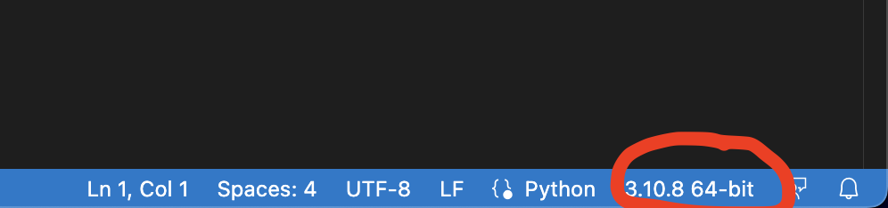

# Session 1
## Summary

In this session, we configured our development environment for an optimal experience when developing with python.
We talked about some (fun) facts and myths about python and it's ecosystem, please take a look at the slides attached (hd-python-1.pdf).
We finally installed some dependencies to create a web version of `Hello, World!" using FastAPI as a web framework.

If you want to take a look at the result, please follow the steps below:

## Prerequisites

You should have a python-friendly setup already installed and configured in your system. For simplicity, I recommend VS Code.
If this is your first time developing with Python and you don't have an IDE already configured, follow the steps below:

- Install `Python 3.8+` in your system (I recommend the latest stable version, `Python 3.10`). If you are not sure how to do this, follow the steps at the [Official Documentation](https://wiki.python.org/moin/BeginnersGuide/Download).

- Install and configure [VS Code](https://code.visualstudio.com) (or any other IDE) for python development, including `black` as a code formatter.
    - [Python in visual studio](https://code.visualstudio.com/docs/languages/python).
    - About [Black](https://black.readthedocs.io/en/stable/) formatter and why its awesome.

## Create and configure a virtual environment. 

You can call it whatever you want, I will call mine `hd-python`. To do this, follow the steps below:

I like to have a centralized `~/.virtualenvs` directory, but this is a personal preference. You can also create a `venv` directory inside your project.

Create the virtual environment (You only need to do this once):
```
mkdir ~/.virtualenvs
python3 -m venv ~/.virtualenvs/hd-python
```

Activate the virtual environment (Linux & Mac):
```
source ~/.virtualenvs/hd-python/bin/activate
```
or run the script (Windows only):
```
~/.virtualenvs/hd-python/Scripts/activiate.bat
```

Now, open VS Code (if it was already opened, close it and open it again...) and **make sure you select the correct interpreter** by clicking on the python version at the bottom of the screen:



## Install the dependencies for this session

For this session we only installed [FastAPI](https://fastapi.tiangolo.com) (and its required dependency, [Uvicorn](https://www.uvicorn.org)).

FastAPI is a fast web framework, very easy to use and with a ton of features that allow for rapid development of REST APIs. It relies on [Starlette](https://www.starlette.io) and [Pydantic](https://pydantic-docs.helpmanual.io), two modern libraries that make it very easy to build web applications with python.

To install FastAPI and uvicorn, simply run:

```
pip install fastapi uvicorn
```

## Write the code

Now we only need to create a single file `main.py` and include the code below (if you cloned this repo, that file already exists):

```
import fastapi

app = fastapi.FastAPI()

@app.get("/")
async def say_hello():
    return "Hello, world!"
```

Now, this is a short file with only a few lines of code but there's **a lot** going on here. Let's explore line by line:

```
import fastapi
```

This line tells your program that you want to use some code that exists outside your file. If you are curious about how this works internally, look at the [official documentation](https://docs.python.org/3/reference/import.html) about the import system and all the things it can do.

Then, we create an instance of the FastAPI class:
```
app = FastAPI()
```
When we call this line, our `app` variable holds a reference to an instance of the `FastAPI` class.

Finally, we have:
```
@app.get("/")
async def say_hello():
    return "Hello, world!"
```

This is the most complex block of all our code, so we will decompose it line by line (We will revisit this topics in the next 2 sessions).

We will start by the line in the middle: 
```
async def say_hello():
```
In python, as function is created by the keyword `def`. This tells the interpreter that we are about to define a function. It has a very simple syntax, its just the `def` keyword, a `name` for the function (`sat_hello`), and the arguments the funcion needs to execute its code. In this case we don't really need any arguments, so its just empty brackets `()`.

The `async` keyword makes our function special allowing us to write **concurrent code** using `async/await` syntax, very similar to what other languages like Javascript provide. The `async` keyword transforms our function into a [coroutine](https://docs.python.org/3/library/asyncio-task.html) that returns a future (`awaitable`). 
If you read the [official documentation about `asyncio`](https://docs.python.org/3/library/asyncio.html) you will see that we need other stuff to make asyncronous code work in python, but fortunately in our case all of this complexity is gracefully handled by FastAPI (and its dependencies).

The final line exits our function and returns a `string` with the value of `"Hello, world!"` to the caller:
```
return "Hello, world!"
``` 

Finally, we have a line like this on top of our function:
```
@app.get("/")
```

This is a [decorator](https://wiki.python.org/moin/PythonDecorators), a rather advanced but very useful concept that we will be visiting in the following sessions. For now, the only thing we need to know is that it tells our app that it should call our `say_hello` function whenever the server receives a `GET` request on the `root` (`"/"`) route.

If you feel like all of this is a little bit over your head, don't worry. We will be revisiting all these concepts in session 2.

## Run the code

It's finally time to run our code. Go to a terminal and make sure you are in the same folder as your `main.py` file and that your virtual environment is active.

```
uvicorn main:app --reload
```

You will see a few lines of log messages that look like these:

```
INFO:     Will watch for changes in these directories: ['/Users/chepe/hackerdojo/pythonista/hackerdojo-pythonistas/session_1']
INFO:     Uvicorn running on http://127.0.0.1:8000 (Press CTRL+C to quit)
INFO:     Started reloader process [67210] using StatReload
INFO:     Started server process [67212]
INFO:     Waiting for application startup.
INFO:     Application startup complete.
```

Now, open a browser and you shall see a friendly greeting!


## About Hacker Dojo
The [Hacker Dojo](https://hackerdojo.org) is a community of engineers, artists, scientists, activists, entrepreneurs and other creative people centered around a co-working and social facility. Feel free to drop by and see for yourself what the Dojo is all about.


## Thanks to Intel

These sessions are sponsored by [Intel](https://www.intel.com). Take a look at this post about [How to put your Python skills to work](https://medium.com/intel-tech/how-to-put-your-python-skills-to-work-in-ai-3c581b916a41).

You will learn about the [Edge AI Certification](https://www.intel.com/content/www/us/en/developer/tools/devcloud/edge/learn/certification.html?utm_campaign=python_campaign_q322&utm_source=Medium&utm_medium=Blog&utm_content=python_blog&utm_term=edge_ai_cert) and the [30-Day AI Dev Challenge](https://devchallenge.intel.com/na_30_start?utm_campaign=python_campaign_q322&utm_source=Medium&utm_medium=Blog&utm_content=python_blog&utm_term=5_reasons_header)

Consider joining the challenge!
