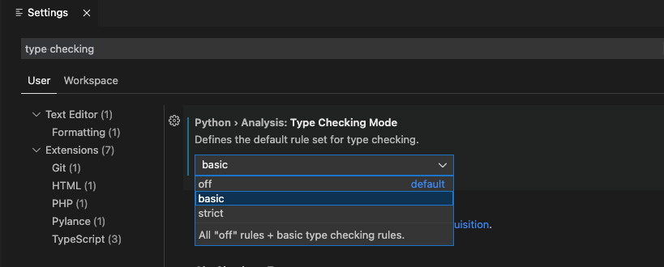

# Session 2
## Summary

Our goal this session is to be able to run a pre-trained machine learning model from a python script. For that, we need to re-visit some of the fundamental building blocks in the Python ecosystem to understand how they work, how they interact with each other and some of the *Gotchas* that might caught you off guard.

## Prerequisites

You should have a python-friendly setup already installed and configured in your system. For simplicity, I recommend VS Code.
If this is your first time developing with python, follow the steps below:

- Install `Python 3.8+` in your system (I recommend the latest stable version, `Python 3.10`). If you are not sure how to do this, follow the steps at the [Official Documentation](https://wiki.python.org/moin/BeginnersGuide/Download).

- Install and configure [VS Code](https://code.visualstudio.com) (or any other IDE) for python development, including `black` as a code formatter.
    - [Python in visual studio](https://code.visualstudio.com/docs/languages/python).
    - About [Black](https://black.readthedocs.io/en/stable/) formatter and why its awesome.
- Have a virtual environment already configured as an interpreter for your project.
    - For this, you can try completing all the steps from [Session 1](../session_1/README.md).
- Activate your virtual envirnoment and install Jupyter Notebook.

```
source ~/.virtualenvs/hd-python/bin/activate
pip install notebook
```
- Open VS Code and make sure you are using the interpreter from your virtual environment.
- Install the Jupyter VS Code extension (by Microsoft).


## Overview of the building blocks

Among the multiple programming languages and paradigms that exists, there is one thing that is always present: The ability to group related things togehter.
This is necessary because, as humans, grouping things together and treating them as a single unit allows us to think more about the problem we are trying to solve, and think less about the details of whats actually happening underneath.

As a languange that aims for simplicity, Python allows programmers to group things together with great flexibility. In order to understand how this works, we need to know (at least partially) how Python is built, what happens when I run my script with `python my_script.py` and how programs written in Python are usually structured.

Some of the concepts we will glance over are:

- Types and built-in types.
- Variables, scopes and lifetimes.
- Loops and comprehensions.
- Functions.
- Classes and magic *dunder* methods (double underscore methods).
- Modules, packages and the import system.

Depending on the type of a variable, it will behave differently when used in combination with the different operators that exist in python. You can take a look at al the operators available here:

## Built-in types and what you can do with them

The set of built-in types in python is fairly limited but very useful. You can use those types to solve any computing problem you might face. It is my opinion that knowing the details around these types can be very beneficial and save you time (like, a lot...) in the future.

There are a few more types available, and you may find an interesting read at the [Official Documentation](https://docs.python.org/3.10/library/stdtypes.html#), but for now, let's take a look at the ones I've been using more:

- Boolean (`bool`)
- Integer (`int`)
- Floating point (`float`) and Decimal (`decimal.Decimal`)
- List (`list`)
- Tuple (`tuple`)
- Set (`set`)
- Dict (`dict`)
- String (`str`)

### Modern Python: Type hints

It is a fact that a trend in the industry is to provide some typing information as we write code. This helps us prevent and catch errors before we actually run our code, as well as (sometimes) make it execute faster (ie. typescript vs javascript) or provide functionality that would be very hard to implement without typing information.

Since Python 3.5, you can add type hints to your code by importing the definitions in the [typing](https://docs.python.org/3/library/typing.html) module. Starting on Python 3.10, there is no need to import anything as it is becoming a fundamental part of the language.

I recommend that you enable your linter to warn you about typing information and use them as much as possible. To do this, go to the settings page in VS Code (Mac: `cmd + ,` Win,Linux: `crtl + ,`), write `type checking` and select the corresponding option in the 

Personally, I have a `strict` setting for my projects, but if you just want to get your feet wet and see what this type hints are all about you may start with the `basic` setting.



Please take a look at the [Session 2 Notebook](./Session_2.ipynb) to take a look at interesting things we can do with each type and the corresponding hints.


## Scopes and lifetimes

In computer science `scope` refers to the places from where a certain symbol is available (visible). In Python there are three main scopes that we care about:

- Global (please, please, please... don't use this one)
- Global to a module/package (Try to avoid)
- Local (whenever possible, use this.)

The lifecycle of a symbol is called `lifetime`. In python, the lifetime of a symbol will be the same as the `context` that contains it. In other words, when the context is over, making the object out of scope, it will end its lifecycle (ie. a local variable defined inside a function ceases to exist as the funcion ends).

## Loops

There are two main constructs to create loops in python: `while` and `for`
Both of them can be useful in certain conditions, although I find myself almost never using a `while` loops.
A `while` loop should be used when we are expecting a certain condition to change, whereas a `for` loop is mainly used to iterate over collections. In Python, the `for` construct is more like a `foreach` in other languages.

One of my favorite constructs in python are list comprehensions (and dict, set comprehensions as well). It is a special syntax that allow you to write a loop that builds a list in a single line. So, something that looks like this:

```
alphabet = 'abcdefghijklmnopwrstuvwxyz'

first_ten = []
for a in alphabet[:10]:
    first_ten.append(a)
```
Becomes:

```
alphabet = 'abcdefghijklmnopwrstuvwxyz'
first_ten = [c for c in alphabet[:10]]
```

And you can even use constraints to build your new list, so this:

```
alphabet = 'abcdefghijklmnopqrstuvwxyz'
odd_index = []
for i,c in enumerate(alphabet):
    if i % 2 != 0:
        odd_index.append(c)
```

becomes:

```
alphabet = 'abcdefghijklmnopqrstuvwxyz'
odd_index = [c for i,c in enumerate(alphabet) if i % 2 != 0]
```

## Functions

A function is a block of code that we can group together so that we can execute that same block multiple times during the execution of our program. We already looked at the basic syntax for defining functions in [Session 1](../session_1/README.md) but let's try to look a little deeper into it:

```
def my_function(a, b, c=0, d=0):
    return (a+c) * (b + d)
```

In `my_function` I have defined a few parameters:

- `a` and `b` are *positional* arguments, and they are mandatory.
- `c` and `d` are `keyword` arguments and have a default value defined. Passing a value for `c` and `d` is optional and, depending on which values I choose to pass, there are several ways to call `my_function`:

```
my_function(1,2)
my_function(1,2,3)
my_function(1,2,c=3)
my_function(1,2,3,4)
my_function(a=1,b=2,c=3,d=4)
my_function(1,2,d=4)
```
All the previous statements are valid function calls, and they all do different things. Note that I can use kewyword syntax for positional arguments but after that, all arguments MUST be keyword arguments. For example, this would throw an error:

```
my_func(a=1, 2)
```

### Pitfalls: Mutable types as default values (don't do it)

When you run a Python script or import it as a module, all the top level statements will be evaluated. That includes any global variable initialization, function calls and function definitions. As everything else in Python, a function is an object that exists during the lifetime of a program, and as any other object, some of it's members have values assigned. This is the case of the default values for `keyword` arguments.

For most default values, this is great: whenever someone invokes a function without passing a value, the default will be used. The problem arises when the type of this default value is a mutable type (list, dict, etc) and said value is modified inside the function. The next time that function is called, the default value will be different from the first time:

```
def func(key, value, d = {}):
    d[key] = value
    return d
```

When we call it the first time, the result is what we expect:

```
func('first', 1)
```
this outputs `{'first': 1}`

And when we call it the second time:
```
func('second', 2)
```

We would expect to see `{'second': 2}`, however, what we get is:

 ```
 {
    'first': 1, 
    'second': 2
}
```

This behavior is a consequence of the fudamental design of the Python language and, arguably, can be a *useful* feature (ie. memoization). However, there are much better way to implement this kind of behaviors whenever we intend to.

If you need to use a mutable type for a function, my recommendation is that you use an invalid value as the default and then assign it to the variable when the function execution starts. A common idiom for this very common case is a shorthand for:

```
if d == None
    d = {}
```
has an equivalent as:

```
d = d or {}
```

So now, our function looks like this:

```
def func(key, value, d = None):
    d = d or {}

    d[key] = value
    return d
```

and after calling it 2 times, the result is what we expect:

```
func('first', 1)
func('second', 2)
```
Now the result is the expected `{'second': 2}`

## Classes

A class allow us to define our own types. The syntax is very simple and similar to other languages. It allows us to group together several related functions and data. Some people like OOP, others prefer using only functions. The good thing is that Python allows you to use one or the other (or both) whenever you want.

For this section, take a look at the [notebook](./Session_2.ipynb).


### Magic *dunder* methods

A *dunder* method (special methods or Double Underscore Method) is a method defined inside a class with [special behavior](https://docs.python.org/3/reference/datamodel.html#specialnames), suche methods' name starts and ends with `__` (double underscore, thus the *dunder* moniker). 

There's a special magic that can happen when a certain method is implemented: It allows us to use standard features of Python with our custom objects. There are many *dunder* methods available, but some of the ones I find very useful are:

- Initialization: `__init__`
- String representation methods:   `__str__` and `__repr__`
- Hash: `__hash__`
- Sorting and comparison: `__lt__`, `__lte__`, `__gt__`, `__gte__`

### Hack: Get free out-of-the-box functionality with `dataclass`

The `dataclass` decorator is part of the standard library (meaning: you have it already) and provides automatically generated *dunder* methods that make your life easy and save you precious developer time.

One feature that I find particularly useful is the ability to compare (and sort) objects out of the box, based on the existing members.

Check out the [Official Documentation for dataclasses](https://docs.python.org/3/library/dataclasses.html) and also the examples provided in the [notebook](./Session_2.ipynb).

### Better Hack: Pydantic

[Pydantic](https://pydantic-docs.helpmanual.io) is a library that takes these concepts to the next level. It has an implementation for dataclasses that is a drop-in replacement for the standard library but also provide a `BaseModel` type that is great for modeling and validating data. A lot of the [FastAPI](https://fastapi.tiangolo.com) functionality introduced in [Sesion 1](../session_1/README.md) is built using Pydantic to provide the magic. We will take a deeper look at pydantic in the 3rd session.


## Modules, packages and the import system

The import system is a Python component that allows us to package (and publish) fractions of our code. A module is the next level of grouping after functions and classes as it allows the programmer to put multiple class definitions and functionality together in a file. And what do we get if we create a directory and put several modules in there? That would be a `package` and as the name suggests, with just a few extra steps it can be packaged for publishing and distribution.

It is important to know that every time the interpreter runs an `import` statement, all the top level lines will run (as we saw on the `functions` section). But also, if we do the same import in multiple places in our program, it will only run once (under most circumstances). 

If we want our module to be able to run as a script, we can use the following lines (that I'm sure you've seen if this is not your first day playing with Python):

```
if __name__ == "__main__":
    # Do stuff when invoked with `python myscript.py`
    ... 
```

When a Python module or package is imported, `__name__` is set to the module’s name. Usually, this is the name of the Python file itself without the .py extension. However, if the module is executed in the top-level code environment, its __name__ is set to the string '__main__'. This way, we can prevent some of the code from running when using the file as a module, but execute some special things for us when invoked as top-level by the interpreter.

Depending on the version of Python you are using, you might need to include a `__init__.py` file as part of your package. I recommend that you always create this file. In many cases this item can be empty and is just used as a marker, but if your package is more complex, you might want to isolate the user of your library from some parts of your code and provide a more useful interface for them to use.

So, in our project, we might have a combination of modules and libraries that looks like this:

```
project_folder
    | main.py                   # Entry point
    |-firstmodule.py            # Some functionality in a module
    |-mypackage                 # Some extra functionality in a package
        |-__init__.py           # Marker file
        |-secondmodule.py       # Actual implementations
```


## Putting it all together: Custom inferencing library using ***Intel's OpenVINO***

We will define a single class `Witi` (What is this image?) that loads a pre trained model when we create an instance so we can call a `predict` method and get a description for an image we give it.

As always, take a look at the [notebook](./Session_2.ipynb) to see how this is done and also look at the code in this repo.

## Thanks to Intel

These sessions are sponsored by [Intel](https://www.intel.com). Take a look at this post about [How to put your Python skills to work](https://medium.com/intel-tech/how-to-put-your-python-skills-to-work-in-ai-3c581b916a41).

You will learn about the [Edge AI Certification](https://www.intel.com/content/www/us/en/developer/tools/devcloud/edge/learn/certification.html?utm_campaign=python_campaign_q322&utm_source=Medium&utm_medium=Blog&utm_content=python_blog&utm_term=edge_ai_cert) and the [30-Day AI Dev Challenge](https://devchallenge.intel.com/na_30_start?utm_campaign=python_campaign_q322&utm_source=Medium&utm_medium=Blog&utm_content=python_blog&utm_term=5_reasons_header)

Consider joining the challenge!